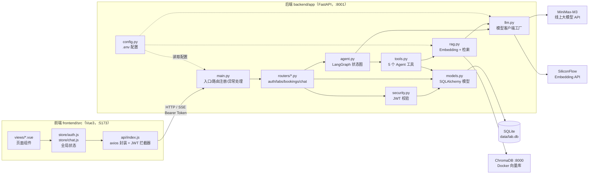
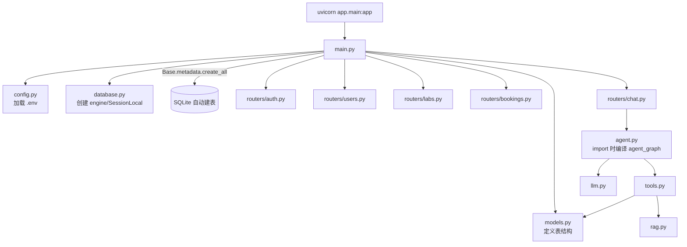
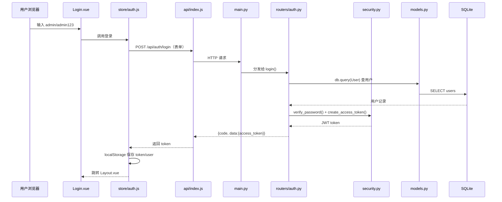
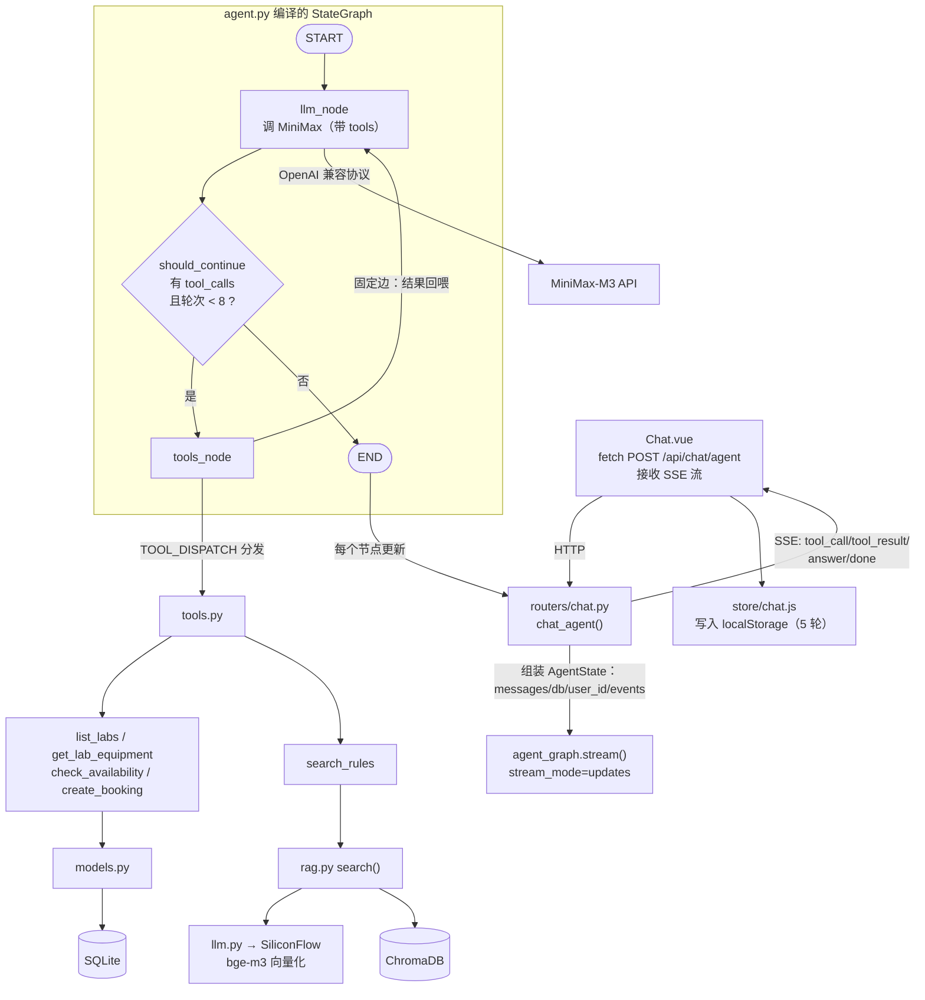

# 智能实验室预约系统（Intelligent Laboratory Reservation System）

基于 **Vue 3 + FastAPI + LangGraph** 的智能实验室预约系统。除常规的实验室/设备/预约管理外，内置 AI 助手：支持 RAG 规则知识库问答，以及基于 **LangGraph 状态图** 的智能预约 Agent（自动调用工具完成「澄清 → 查空闲 → 确认 → 提交预约」全流程）。

## 功能特性

- 用户认证：注册 / 登录（JWT），学生与管理员两种角色
- 实验室管理：实验室 CRUD、设备管理、开放时间与状态维护
- 预约审核：学生提交预约（pending），管理员审核通过/驳回，时段冲突自动检测
- AI 普通对话：MiniMax 大模型 SSE 流式输出 + RAG 检索实验室规则知识库
- 智能预约 Agent：LangGraph StateGraph 驱动，过程节点（思考 / 工具调用 / 工具结果）前端可见
- 对话记录：前端 localStorage 持久化（按账号隔离，最多保留最近 5 轮），刷新、重登不丢失

## 技术栈

| 层 | 技术 |
|---|---|
| 前端 | Vue 3、Vite 5、Element Plus、Vue Router 4、Axios、原生 SSE（fetch ReadableStream） |
| 后端 | Python 3.14、FastAPI、Uvicorn、SQLAlchemy 2.0、Pydantic v2、PyJWT |
| 数据库 | SQLite（文件库，免安装） |
| Agent 框架 | LangGraph（StateGraph / Node / Conditional Edge） |
| 大模型 | MiniMax-M3（OpenAI 兼容接口，`https://api.minimax.cn/v1`） |
| Embedding | SiliconFlow `Pro/BAAI/bge-m3`（1024 维） |
| 向量库 | ChromaDB 0.6.3（Docker 容器，通过 httpx 直连 v2 REST API，无客户端依赖） |

## 项目目录

```
Intelligent-Laboratory-Reservation-System/
├── backend/                        # 后端服务
│   ├── app/
│   │   ├── main.py                 # FastAPI 入口：中间件、异常处理、路由注册
│   │   ├── config.py               # 配置（pydantic-settings，读取 .env）
│   │   ├── database.py             # SQLAlchemy 引擎与会话
│   │   ├── models.py               # User / Laboratory / Equipment / Booking 模型
│   │   ├── schemas.py              # 统一响应结构与校验模型
│   │   ├── security.py             # JWT 签发与校验、密码哈希
│   │   ├── llm.py                  # MiniMax / SiliconFlow 客户端工厂
│   │   ├── agent.py                # ★ LangGraph 预约 Agent（状态图定义与编译）
│   │   ├── tools.py                # Agent 工具：查实验室/设备/空闲/规则/提交预约
│   │   ├── rag.py                  # RAG 服务：Embedding + ChromaDB 检索
│   │   └── routers/
│   │       ├── auth.py             # 注册 / 登录
│   │       ├── users.py            # 用户管理（管理员）
│   │       ├── labs.py             # 实验室与设备 CRUD
│   │       ├── bookings.py         # 预约提交 / 审核 / 我的预约
│   │       └── chat.py             # AI 对话（SSE）+ LangGraph Agent 接口
│   ├── data/lab.db                 # SQLite 数据库文件（自动生成）
│   ├── uploads/                    # 上传文件目录
│   ├── ingest.py                   # 知识库入库脚本（docs/rules → ChromaDB）
│   └── requirements.txt
├── frontend/                       # 前端应用
│   └── src/
│       ├── api/                    # Axios 封装
│       ├── router/                 # 路由与登录守卫
│       ├── store/
│       │   ├── auth.js             # 登录状态（localStorage）
│       │   └── chat.js             # AI 对话状态（localStorage 持久化，限 5 轮）
│       └── views/
│           ├── Login.vue           # 登录 / 注册
│           ├── Layout.vue          # 主布局
│           ├── Labs.vue            # 实验室浏览与预约
│           ├── MyBookings.vue      # 我的预约
│           ├── Chat.vue            # AI 助手（流式 + 过程节点展示）
│           ├── Profile.vue         # 个人中心
│           ├── AdminUsers.vue      # 用户管理
│           ├── AdminLabs.vue       # 实验室 / 设备管理
│           └── AdminBookings.vue   # 预约审核
├── docs/
│   └── rules/lab_rules.md          # 实验室规则知识库源文档
└── README.md
```

## LangGraph Agent 结构

```
START → llm（调用大模型决策）── 条件边 should_continue ──┐
   ↑                    │ 有 tool_calls 且 ≤8 轮 │ 无 tool_calls
   │                    ▼                        ▼
   └──── tools（执行工具，结果回喂）           END（输出最终答复）
```

- **State**：`messages`（对话消息）、`rounds`（轮次，上限 8 防死循环）、`db`、`user_id`、`events`（过程事件）
- **节点**：`llm`（带 tools 调用 MiniMax）、`tools`（分发执行 5 个本地工具）
- **流式**：`graph.stream(stream_mode="updates")` 逐节点产出事件，转为 SSE 推给前端

## 执行逻辑图（Mermaid）

> 以下图表可在支持 Mermaid 的 Markdown 预览器中直接渲染（如 VS Code 安装 Mermaid 插件）。

### 1. 项目整体架构（文件分层与调用关系）



### 2. 后端启动时的文件加载链



### 3. 登录流程（文件调用时序）



之后每个请求的链路：`任意 .vue → api/index.js（自动加 Authorization 头）→ main.py → 对应 router → security.get_current_user（验 JWT）→ 业务代码`。

### 4. 智能预约 Agent 流程（核心）



**一次真实预约的文件流转顺序**：

| 步骤 | 文件流转 | 发生了什么 |
|---|---|---|
| 1 | Chat.vue → chat.py → agent.py（START→llm） | 用户问“有哪些实验室” |
| 2 | agent.py → llm.py → MiniMax | 模型决定调用 `list_labs` |
| 3 | agent.py（条件边→tools）→ tools.py → models.py → SQLite | 查到 3 间实验室 |
| 4 | tools → llm → MiniMax | 模型整理结果，走 END，SSE 返回 |
| 5 | Chat.vue → chat.py（再次请求，历史消息进 messages） | 用户说“预约人工智能实验室明天下午2-4点” |
| 6 | llm → tools（check_availability）→ models.py → SQLite | 查占用，空闲；模型回复“请确认”后 END |
| 7 | Chat.vue → chat.py（第三次请求） | 用户说“确认” |
| 8 | llm → tools（create_booking）→ models.py → SQLite | 写入预约记录，返回 booking_id |
| 9 | Chat.vue → store/chat.js | 对话写入 localStorage |

## 快速开始

### 1. 启动 ChromaDB（Docker）

```bash
docker start enterpriseqa-chromadb
# 首次使用：docker run -d --name enterpriseqa-chromadb -p 8000:8000 chromadb/chroma:0.6.3
```

### 2. 启动后端

```bash
cd backend
python -m venv .venv
.\.venv\Scripts\pip install -r requirements.txt   # Windows
.\.venv\Scripts\python -m uvicorn app.main:app --host 0.0.0.0 --port 8001
```

配置在 `backend/.env`（`LLM_API_KEY`、`SILICONFLOW_API_KEY` 等，见 `app/config.py`）。

### 3. 导入知识库（可选，启用规则检索）

```bash
cd backend
.\.venv\Scripts\python ingest.py
```

### 4. 启动前端

```bash
cd frontend
npm install
npm run dev    # http://localhost:5173
```

## 演示账号

| 角色 | 用户名 | 密码 |
|---|---|---|
| 管理员 | `admin` | `admin123` |
| 学生 | `student` | `student123` |

## 主要接口

| 方法 | 路径 | 说明 |
|---|---|---|
| POST | `/api/auth/register` `/api/auth/login` | 注册 / 登录 |
| GET/POST | `/api/labs` | 实验室列表 / 新建（管理员） |
| POST | `/api/bookings` | 提交预约（冲突检测） |
| POST | `/api/bookings/{id}/review` | 审核预约（管理员） |
| POST | `/api/chat` | AI 普通对话（SSE 流式 + RAG） |
| POST | `/api/chat/agent` | 智能预约 Agent（SSE + LangGraph） |
| GET | `/api/health` | 健康检查 |
