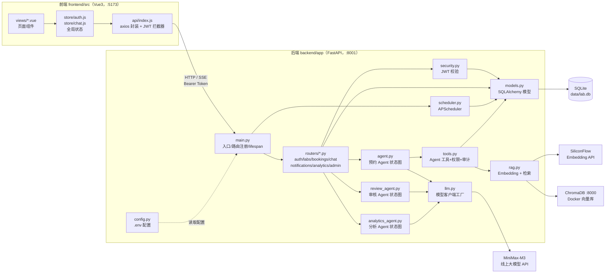
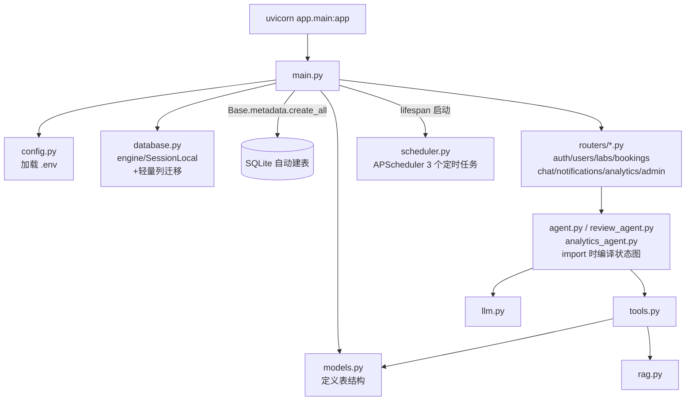
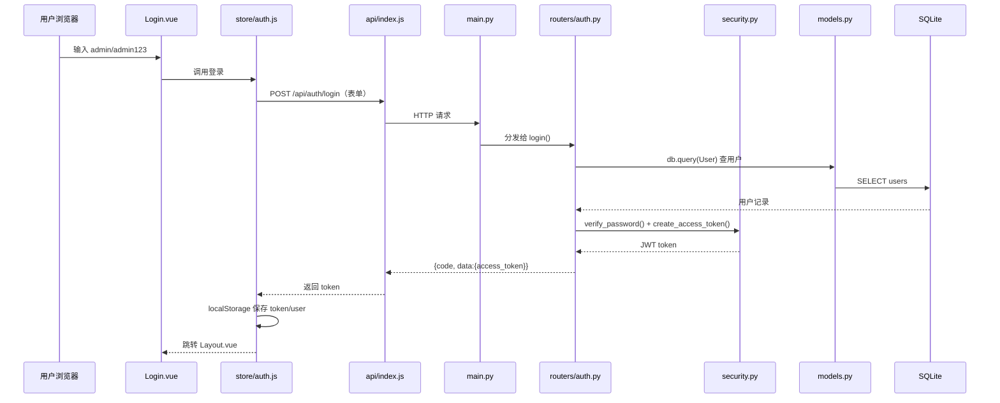
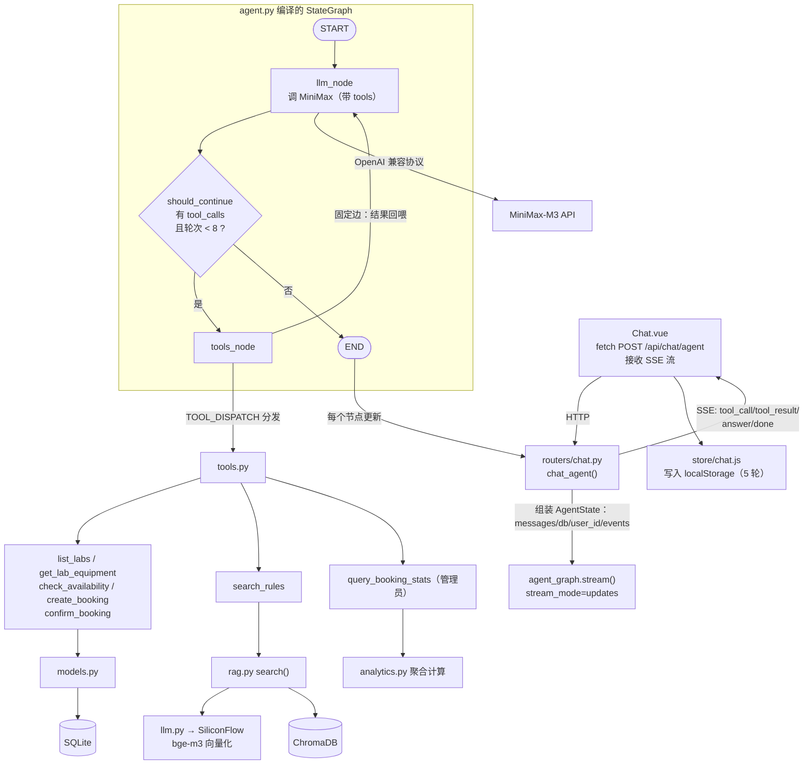
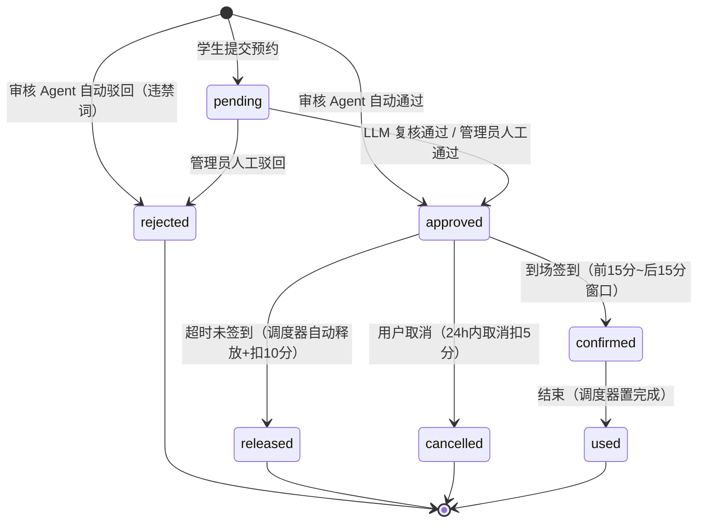

# 智能实验室预约系统（Intelligent Laboratory Reservation System）

基于 **Vue 3 + FastAPI + LangGraph** 的智能实验室预约系统。除常规的实验室/设备/预约管理外，内置三个 LangGraph Agent：智能预约 Agent（自动调用工具完成「澄清 → 查空闲 → 确认 → 提交预约」全流程）、管理员审核 Agent（AI 规则初审 + 人工终审的人机协同）、数据分析 Agent（自然语言查运营数据并出图表），另由 APScheduler 驱动定时提醒与超时自动释放。

## 功能特性

- 用户认证：注册 / 登录（JWT），学生与管理员两种角色
- 实验室管理：实验室 CRUD、设备管理、开放时间与状态维护
- 信用分体系：初始 100 分，临近开始取消扣 5 分、超时未签到扣 10 分，低于 60 禁止预约
- 智能预约 Agent：LangGraph StateGraph 驱动，过程节点（思考 / 工具调用 / 工具结果）前端可见
- **人机协同审核 Agent**：预约提交即触发——纯规则扫描（时长/晚间/用途/信用分/容量/临时/周末 7 类信号）零成本初审，明确违规自动驳回、完全合规自动通过，边界情况交大模型复核，仍拿不准转人工终审；大模型故障安全降级转人工
- **定时提醒 Agent（APScheduler）**：开始前 30 分钟提醒、待审超 2 小时催办管理员、开始后 15 分钟未签到自动释放并扣信用分、结束自动置完成
- **数据分析 Agent**：自然语言提问（如"这周哪个实验室最忙"），大模型只解析意图为白名单参数，确定性 SQL 聚合计算，输出 ECharts 图表 + 中文运营洞察（大模型不碰 SQL，零注入风险）
- 站内消息：审核结果 / 开始前提醒 / 催办 / 系统通知，铃铛未读角标 + 60 秒轮询
- 到场签到：通过后需在开始前 15 分钟 ~ 开始后 15 分钟内签到确认
- AI 普通对话：MiniMax 大模型 SSE 流式输出 + RAG 检索实验室规则知识库
- 安全治理：Agent 工具按角色裁剪 + 二次校验，工具调用全量审计日志
- 对话记录：前端 localStorage 持久化（按账号隔离，最多保留最近 5 轮），刷新、重登不丢失

## 技术栈

| 层 | 技术 |
|---|---|
| 前端 | Vue 3、Vite 5、Element Plus、Vue Router 4、Axios、ECharts 5、原生 SSE（fetch ReadableStream） |
| 后端 | Python 3.14、FastAPI、Uvicorn、SQLAlchemy 2.0、Pydantic v2、PyJWT、APScheduler 3 |
| 数据库 | SQLite（文件库，免安装；启动时 PRAGMA + ALTER TABLE 轻量迁移新列） |
| Agent 框架 | LangGraph（StateGraph / Node / Conditional Edge，模块导入时编译一次全局复用） |
| 大模型 | MiniMax-M3（OpenAI 兼容接口，`https://api.minimax.cn/v1`） |
| Embedding | SiliconFlow `Pro/BAAI/bge-m3`（1024 维） |
| 向量库 | ChromaDB 0.6.3（Docker 容器，通过 httpx 直连 v2 REST API，无客户端依赖） |

## 项目目录

```
Intelligent-Laboratory-Reservation-System/
├── backend/                        # 后端服务
│   ├── app/
│   │   ├── main.py                 # FastAPI 入口：lifespan 启停调度器、路由注册
│   │   ├── config.py               # 配置（pydantic-settings，读取 .env）
│   │   ├── database.py             # SQLAlchemy 引擎与会话、轻量列迁移
│   │   ├── models.py               # User / Laboratory / Equipment / Booking / Notification 模型
│   │   ├── schemas.py              # 统一响应结构与校验模型
│   │   ├── security.py             # JWT 签发与校验、密码哈希
│   │   ├── llm.py                  # MiniMax / SiliconFlow 客户端工厂
│   │   ├── agent.py                # ★ LangGraph 智能预约 Agent
│   │   ├── review_agent.py         # ★ 管理员审核 Agent（规则初审 → LLM 边界复核）
│   │   ├── analytics.py            # 数据分析确定性统计计算（使用率/热门时段/趋势/状态分布）
│   │   ├── analytics_agent.py      # ★ 数据分析 Agent（解析问题 → 聚合 → 生成洞察）
│   │   ├── scheduler.py            # APScheduler 定时任务（提醒/催办/爽约释放/完成）
│   │   ├── tools.py                # Agent 工具 + 角色权限 + 审计
│   │   ├── rag.py                  # RAG 服务：Embedding + ChromaDB 检索
│   │   └── routers/
│   │       ├── auth.py             # 注册 / 登录
│   │       ├── users.py            # 用户管理（管理员）
│   │       ├── labs.py             # 实验室与设备 CRUD
│   │       ├── bookings.py         # 预约提交 / 审核 / 签到 / 我的预约
│   │       ├── notifications.py    # 站内消息
│   │       ├── analytics.py        # 数据分析 Agent（SSE，管理员）
│   │       ├── admin.py            # 审计日志 / 定时任务手动触发（管理员）
│   │       └── chat.py             # AI 对话（SSE）+ 预约 Agent 接口
│   ├── data/lab.db                 # SQLite 数据库文件（自动生成）
│   ├── uploads/                    # 上传文件目录
│   ├── ingest.py                   # 知识库入库脚本（docs/rules → ChromaDB）
│   ├── seed.py                     # 初始化账号 / 实验室 / 设备
│   ├── gen_test_data.py            # 生成测试数据（学生账号 + 历史预约 + 站内消息）
│   └── requirements.txt
├── frontend/                       # 前端应用
│   └── src/
│       ├── api/                    # Axios 封装
│       ├── router/                 # 路由与登录守卫
│       ├── store/
│       │   ├── auth.js             # 登录状态（localStorage）
│       │   └── chat.js             # AI 对话状态（localStorage 持久化，限 5 轮）
│       └── views/
│           ├── Login.vue           # 登录 / 注册
│           ├── Layout.vue          # 主布局（通知铃铛 + 未读轮询）
│           ├── Labs.vue            # 实验室浏览与预约
│           ├── MyBookings.vue      # 我的预约（签到 / 取消 / 新状态展示）
│           ├── Chat.vue            # AI 助手（流式 + 过程节点展示）
│           ├── Profile.vue         # 个人中心（信用分）
│           ├── AdminUsers.vue      # 用户管理（调信用分）
│           ├── AdminLabs.vue       # 实验室 / 设备管理
│           ├── AdminBookings.vue   # 预约审核（AI 审核标识 / 手动执行定时任务）
│           └── AdminAnalytics.vue  # 数据分析（自然语言提问 + ECharts 图表）
├── docs/
│   └── rules/lab_rules.md          # 实验室规则知识库源文档
└── README.md
```

## LangGraph Agent 结构

### 1. 智能预约 Agent（agent.py）

```
START → llm（调用大模型决策）── 条件边 should_continue ──┐
   ↑                    │ 有 tool_calls 且 ≤8 轮 │ 无 tool_calls
   │                    ▼                        ▼
   └──── tools（执行工具，结果回喂）           END（输出最终答复）
```

- **State**：`messages`、`rounds`（上限 8 防死循环）、`db`、`user_id`、`events`（过程事件）
- **工具**：查实验室/设备/空闲/规则/提交预约/签到/查统计，按角色裁剪 + 执行前二次校验 + 全量审计
- **流式**：`graph.stream(stream_mode="updates")` 逐节点产出事件，转为 SSE 推给前端

### 2. 管理员审核 Agent（review_agent.py，人机协同核心）

```
START → rule_scan（确定性规则扫描，零 token）
            ├─ 命中违禁词 → rejected（自动驳回）
            ├─ 无任何信号 → approved（自动通过）
            └─ 有边界信号 → llm_review（大模型复核用途）
                              ├─ approved / rejected
                              └─ manual（转人工终审；LLM 故障同样降级 manual）
```

- **7 类边界信号**：时长 >3h、20:00 后晚间使用、用途模糊、信用分 <85、人数超容量 70%、距开始 <2h 的临时预约、周末使用
- **明确违规**（直接驳回）：明火、易燃易爆、赌博酗酒、聚餐火锅、住宿过夜等关键词
- 图只做裁决不碰数据库；落库、发通知由 services 层在图外完成

### 3. 数据分析 Agent（analytics_agent.py）

```
START → parse（LLM 把问题解析为白名单参数：metric × range）
      → compute（确定性 SQL 聚合，analytics.py）
      → summarize（LLM 基于关键数字生成中文洞察）
      → END（charts + facts + summary）
```

- **指标**：实验室使用率排行、热门时段、每日趋势、状态分布；**范围**：本周/上周/近7天/近30天
- 大模型只输出结构化参数、只看聚合后的数字，从不接触原始 SQL——零注入风险

### 定时任务（scheduler.py，APScheduler）

| 任务 | 频率 | 行为 |
|---|---|---|
| 开始前提醒 | 每 10 分钟 | 30 分钟内开始且已通过的预约 → 站内消息提醒 |
| 待审核催办 | 每 30 分钟 | 待审超 2 小时 → 催办全体管理员 |
| 爽约释放/完成 | 每 10 分钟 | 开始后 15 分钟未签到 → 自动释放 + 扣信用分 10；已过结束时间 → 置已完成 |

管理员工具页可手动触发全部任务（`POST /api/admin/scheduler/run`）。

## 执行逻辑图（Mermaid）

> 以下图表可在支持 Mermaid 的 Markdown 预览器中直接渲染（如 VS Code 安装 Mermaid 插件）。

### 1. 项目整体架构（文件分层与调用关系）



### 2. 后端启动时的文件加载链



### 3. 登录流程（文件调用时序）



之后每个请求的链路：`任意 .vue → api/index.js（自动加 Authorization 头）→ main.py → 对应 router → security.get_current_user（验 JWT）→ 业务代码`。

### 4. 智能预约 Agent 流程（核心）



**一次真实预约的文件流转顺序**：

| 步骤 | 文件流转 | 发生了什么 |
|---|---|---|
| 1 | Chat.vue → chat.py → agent.py（START→llm） | 用户问"有哪些实验室" |
| 2 | agent.py → llm.py → MiniMax | 模型决定调用 `list_labs` |
| 3 | agent.py（条件边→tools）→ tools.py → models.py → SQLite | 查到 3 间实验室 |
| 4 | tools → llm → MiniMax | 模型整理结果，走 END，SSE 返回 |
| 5 | Chat.vue → chat.py（再次请求，历史消息进 messages） | 用户说"预约人工智能实验室明天下午2-4点" |
| 6 | llm → tools（check_availability）→ models.py → SQLite | 查占用，空闲；模型回复"请确认"后 END |
| 7 | Chat.vue → chat.py（第三次请求） | 用户说"确认" |
| 8 | llm → tools（create_booking）→ services.py → review_agent.py | 写入预约并立即触发审核 Agent：合规自动通过 / 违规自动驳回 / 边界转人工 |
| 9 | Chat.vue → store/chat.js | 对话写入 localStorage；审核结果同时进站内消息 |

### 5. 预约全生命周期（含人机协同审核与定时任务）



## 快速开始

### 1. 启动 ChromaDB（Docker）

```bash
docker start enterpriseqa-chromadb
# 首次使用：docker run -d --name enterpriseqa-chromadb -p 8000:8000 chromadb/chroma:0.6.3
```

### 2. 启动后端

```bash
cd backend
python -m venv .venv
.\.venv\Scripts\pip install -r requirements.txt   # Windows
.\.venv\Scripts\python -m uvicorn app.main:app --host 0.0.0.0 --port 8001
```

配置在 `backend/.env`（`LLM_API_KEY`、`SILICONFLOW_API_KEY` 等，见 `app/config.py`）。启动后 APScheduler 随 lifespan 自动运行。

### 3. 导入知识库（可选，启用规则检索）

```bash
cd backend
.\.venv\Scripts\python ingest.py
```

### 4. 生成测试数据（可选）

```bash
cd backend
.\.venv\Scripts\python seed.py           # 首次：账号 + 实验室 + 设备
.\.venv\Scripts\python gen_test_data.py  # 测试数据：6 个学生 + 约 170 条预约 + 站内消息
```

### 5. 启动前端

```bash
cd frontend
npm install
npm run dev    # http://localhost:5173
```

## 演示账号

| 角色 | 用户名 | 密码 |
|---|---|---|
| 管理员 | `admin` | `admin123` |
| 学生 | `student` | `student123` |
| 学生（测试数据） | `zhangsan` `lisi` `wangwu` `zhaoliu` `sunqi` `zhouba` | `123456` |

## 主要接口

| 方法 | 路径 | 说明 |
|---|---|---|
| POST | `/api/auth/register` `/api/auth/login` | 注册 / 登录 |
| GET/POST | `/api/labs` | 实验室列表 / 新建（管理员） |
| POST | `/api/bookings` | 提交预约（冲突检测 + 自动触发审核 Agent） |
| POST | `/api/bookings/{id}/approve` `/api/bookings/{id}/reject` | 人工审核通过 / 驳回（管理员，自动发站内通知） |
| POST | `/api/bookings/{id}/confirm` | 到场签到（开始前15分~开始后15分窗口） |
| GET | `/api/notifications` | 站内消息列表 / 未读数 / 已读 |
| POST | `/api/admin/analytics/ask` | 数据分析 Agent（SSE：plan/charts/summary/done，管理员） |
| POST | `/api/admin/scheduler/run` | 手动执行全部定时任务（管理员） |
| GET | `/api/admin/audit-logs` | Agent 工具调用审计日志（管理员） |
| POST | `/api/chat` | AI 普通对话（SSE 流式 + RAG） |
| POST | `/api/chat/agent` | 智能预约 Agent（SSE + LangGraph） |
| GET | `/api/health` | 健康检查 |
