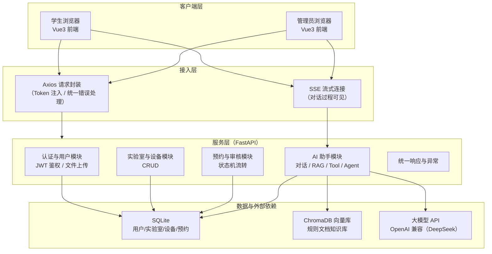
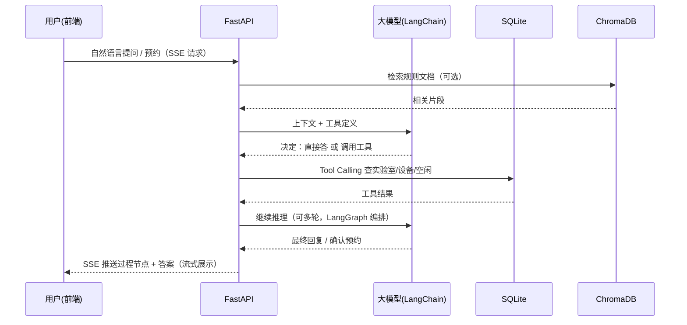
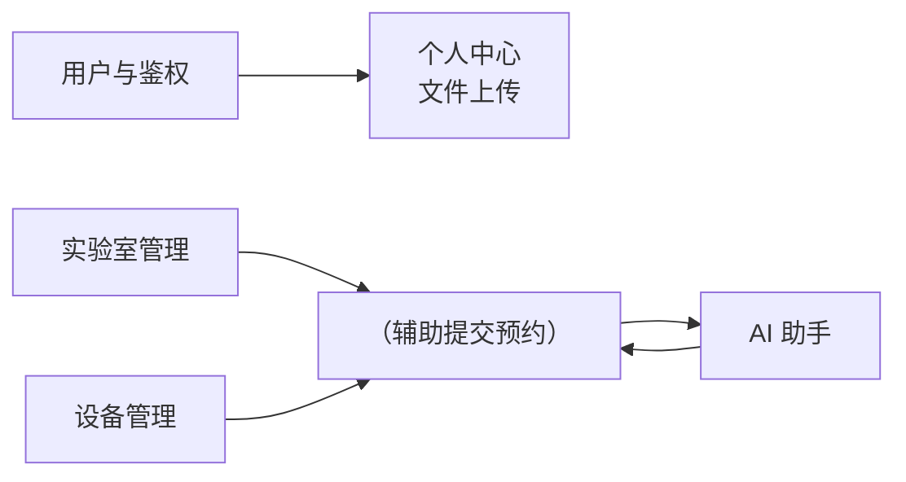
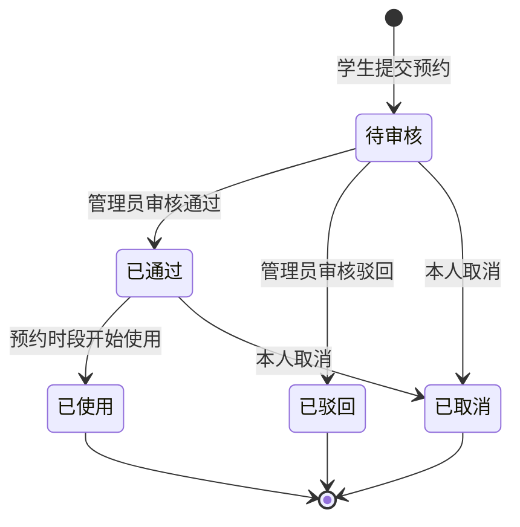
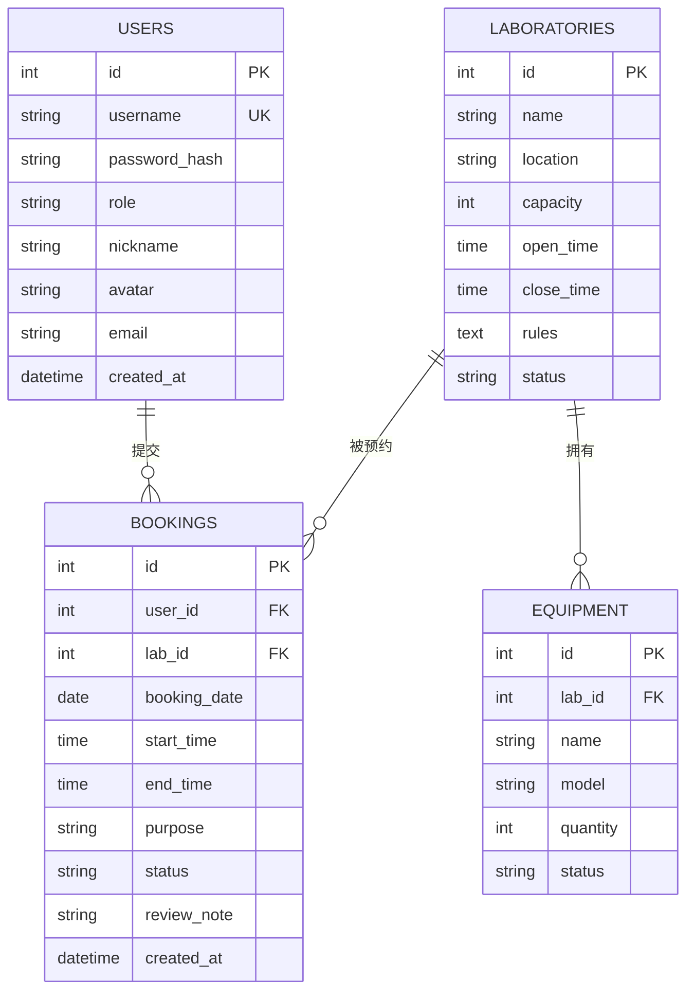
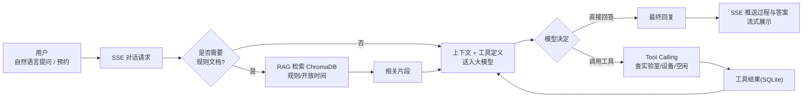
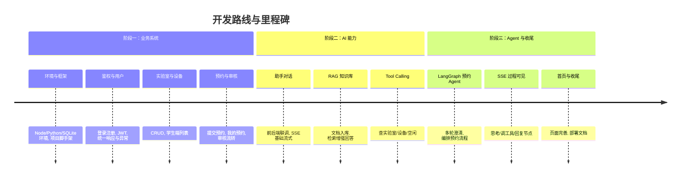

# 智能实验室预约系统 · 项目设计说明

> 参考项目：青戈AI小栈《FastAPI + LangGraph 从零开发智能实验室预约系统》
> 参考链接：<https://ai.codenice.cn/free/ai-smart-lab-booking>
> 文档性质：项目设计说明（技术栈 + 项目功能 + 系统设计）

***

## 目录

1. [项目概述](#1-项目概述)
2. [需求分析](#2-需求分析)
3. [技术栈](#3-技术栈)
4. [系统架构设计](#4-系统架构设计)
5. [功能模块设计](#5-功能模块设计)
6. [数据库设计](#6-数据库设计)
7. [接口设计（API 概览）](#7-接口设计api-概览)
8. [AI 助手链路设计](#8-ai-助手链路设计)
9. [开发路线与里程碑](#9-开发路线与里程碑)
10. [环境要求与部署](#10-环境要求与部署)
11. [风险与注意事项](#11-风险与注意事项)
12. [附录：参考来源](#12-附录参考来源)

***

## 1. 项目概述

### 1.1 项目定位

本项目模仿业界典型的"业务系统 + 大模型 Agent"渐进式开发范式：**先做一套能跑的实验室预约业务系统（学生约实验室/设备、管理员审核），再逐步接入大模型，做出能查规则、查库存、辅助提交预约的 AI 助手**。

核心开发路线（五步递进）：

```
业务系统 → AI 对话 → RAG 知识库 → Tool Calling → LangGraph Agent → SSE 过程可见
```

### 1.2 项目目标

| 目标    | 说明                                          |
| ----- | ------------------------------------------- |
| 业务闭环  | 完成"查实验室/设备 → 选时段 → 提交预约 → 管理员审核 → 使用/取消"全流程 |
| AI 升级 | 让助手从"能聊天"升级到"能查库、能办事"：回答规则、查库存、辅助提交预约       |
| 过程可见  | 通过 SSE 流式输出，让用户看到"思考 / 调工具 / 最终回复"的完整推理过程   |
| 工程规范  | 前后端分离、JWT 鉴权、统一响应与异常、Axios 联调。              |

### 1.3 业务场景

学校有多间实验室，每间实验室各有**设备、人数上限、开放时段与使用规则**。学生需要**查看实验室与设备、选择日期与时段提交预约**；管理员**审核通过或驳回**；本人可**取消待审/已通过的预约**。

***

## 2. 需求分析

### 2.1 角色划分

| 角色           | 职责                                                      |
| ------------ | ------------------------------------------------------- |
| **学生（普通用户）** | 注册/登录；查看实验室与设备；选择日期时段提交预约；查看"我的预约"；取消待审/已通过预约；与 AI 助手对话 |
| **管理员**      | 审核预约（通过/驳回）；维护用户、实验室、设备（CRUD）；查看系统运行情况                  |

### 2.2 业务功能需求（业务系统层）

| 模块     | 功能点      | 说明                              |
| ------ | -------- | ------------------------------- |
| 认证与用户  | 登录注册     | 手机/账号 + 密码，JWT 签发与校验            |
| <br /> | 个人资料     | 头像、昵称、邮箱等维护                     |
| <br /> | 文件上传     | 头像等文件上传（后端保存并回写 URL）            |
| 实验室管理  | 实验室 CRUD | 名称、位置、人数上限、开放时段、使用规则、状态         |
| <br /> | 设备管理     | 所属实验室、设备名称/型号/数量/状态             |
| 预约管理   | 查看实验室/设备 | 学生端列表 + 详情                      |
| <br /> | 提交预约     | 选择日期 + 时段 + 实验室，填写用途，提交后进入"待审核" |
| <br /> | 我的预约     | 列表查看状态（待审核/已通过/已驳回/已取消/已使用）     |
| <br /> | 取消预约     | 本人可取消待审/已通过的预约                  |
| <br /> | 管理员审核    | 通过或驳回（可填驳回原因）                   |

### 2.3 AI 助手功能需求（智能层）

| 能力           | 需求说明                                    |
| ------------ | --------------------------------------- |
| 对话           | 实验室助手聊天，前后端联调，支持多轮                      |
| RAG 检索       | 规则/开放时间等文档进知识库，按问题检索再回答（如"实验室使用规则是什么？"） |
| Tool Calling | 需要实时数据时由模型决定调工具查 SQLite（实验室、设备、空闲时段等）   |
| 智能预约         | 多轮澄清意图 → 编排（查空闲 → 确认 → 提交预约）→ 返回预约结果    |
| 过程可见         | SSE 流式输出，过程节点可见（思考 / 调工具 / 最终回复）        |

### 2.4 非功能需求

| 类别   | 要求                                               |
| ---- | ------------------------------------------------ |
| 安全性  | 密码加密存储；JWT 无状态鉴权；接口权限控制（学生/管理员）；防止越权操作           |
| 健壮性  | 统一响应结构 + 统一异常处理；参数校验；数据库事务保证预约不超卖                |
| 性能   | 列表查询分页；AI 对话 SSE 流式输出，首字低延迟                      |
| 可维护性 | 前后端分离；路由/模型/服务分层；环境配置使用 `.env`                   |
| 可扩展性 | AI 能力按"对话 → RAG → Tool → Agent"渐进式接入，各环节可独立替换/关闭 |

***

## 3. 技术栈

### 3.1 技术栈总览（参考项目原版）

| 端       | 技术                                                          | 用途                         |
| ------- | ----------------------------------------------------------- | -------------------------- |
| **前端**  | Vue 3 · Vite · Element Plus · Axios                         | 组件化页面、工程化构建、UI 组件库、HTTP 请求 |
| **后端**  | Python 3.12+ · FastAPI · SQLAlchemy · JWT                   | 异步 Web 框架、ORM、鉴权           |
| **数据库** | SQLite                                                      | 业务数据持久化                    |
| **AI**  | LangChain · ChromaDB · RAG · Tool Calling · LangGraph · SSE | 大模型应用链路                    |
| **大模型** | OpenAI 兼容协议（如 DeepSeek）                                     | 统一接入各家大模型 API              |

### 3.2 各技术选型说明

| 技术           | 选型理由                                      |
| ------------ | ----------------------------------------- |
| Vue 3 + Vite | 组合式 API 开发效率高，Vite 启动/热更新快                |
| Element Plus | 成熟的 Vue 3 组件库，表格/表单/弹窗开箱即用                |
| Axios        | 统一封装请求、拦截器注入 Token、统一错误处理                 |
| FastAPI      | 基于 Python 类型注解自动生成 OpenAPI 文档，天然支持异步与 SSE |
| SQLAlchemy   | 成熟 ORM，模型驱动建表，事务与关系查询方便                   |
| JWT          | 无状态鉴权，适合前后端分离                             |
| SQLite       | 轻量级本地文件数据库，零配置部署，适合课程与单机场景                |
| ChromaDB     | 轻量级向量数据库，本地运行，适合课程级 RAG                   |
| LangChain    | 封装模型调用、Prompt、检索、工具调用等组件                  |
| LangGraph    | 有向图编排多轮 Agent 流程（澄清 → 查空闲 → 确认 → 提交）      |
| SSE          | 服务端单向流式推送，实现"过程节点可见"                      |

> 说明：以上为参考项目原版技术栈。实际开发中可酌情补充 **Pinia**（状态管理）、**Vue Router**（前端路由）、**Uvicorn**（ASGI 服务器）、**pydantic-settings**（配置管理）、**python-jose/pyjwt**（JWT 实现）、**passlib + bcrypt**（密码哈希）等常用配套，不影响主架构。

### 3.3 环境要求

| 项       | 要求                                |
| ------- | --------------------------------- |
| Node.js | 建议最新 LTS 版本                       |
| Python  | 3.12+                             |
| SQLite  | 3.x+（Python 内置 sqlite3 模块）        |
| IDE     | VS Code（便于跟笔记调试）或 PyCharm         |
| 大模型 API | OpenAI 兼容接口（DeepSeek 等），需自行配置 Key |

***

## 4. 系统架构设计

### 4.1 总体架构（分层）



### 4.2 核心交互链路（AI 预约助手）



***

## 5. 功能模块设计

### 5.1 模块总览



### 5.2 用户与鉴权模块

- 注册：用户名/账号 + 密码，密码哈希存储
- 登录：校验通过后签发 JWT（Access Token）
- 鉴权：请求拦截器携带 Token；后端依赖注入校验当前用户；角色区分学生/管理员
- 接口：注册、登录、获取当前用户信息、更新个人资料、头像上传

### 5.3 实验室与设备管理模块（管理员）

| 实体  | 字段要点                    | 操作          |
| --- | ----------------------- | ----------- |
| 实验室 | 名称、位置、人数上限、开放时段、使用规则、状态 | 增删改查、启停用    |
| 设备  | 所属实验室、名称、型号、数量、状态       | 增删改查、按实验室筛选 |

### 5.4 预约与审核模块

**预约状态机：**



**关键规则：**

- 同一实验室同一时段不可重复被占用（防超卖，用唯一约束/事务保证）
- 预约人数不得超过实验室人数上限
- 仅"待审核/已通过"状态可被本人取消；管理员只能审核"待审核"记录
- 越权校验：学生只能操作本人的预约

### 5.5 AI 助手模块

| 子能力             | 实现要点                                                      |
| --------------- | --------------------------------------------------------- |
| 对话              | 流式调用大模型，前后端 SSE 联调，保留会话上下文                                |
| RAG             | 规则/开放时间等文档切分 → 向量化 → 存入 ChromaDB；提问时检索 TopK 相关片段拼入 Prompt |
| Tool Calling    | 定义"查实验室 / 查设备 / 查空闲时段 / 提交预约"等工具；由模型自主决定是否调用              |
| LangGraph Agent | 用有向图编排多轮流程：澄清意图 → 编排查空闲 → 确认信息 → 提交预约 → 返回结果              |
| SSE 过程可见        | 后端分节点推送 `思考中 / 正在查询 / 调用工具 / 最终回复`，前端流式渲染                 |

***

## 6. 数据库设计

### 6.1 E-R 图



### 6.2 核心表结构

**users（用户表）**

| 字段             | 类型                       | 说明              |
| -------------- | ------------------------ | --------------- |
| id             | INTEGER PK AUTOINCREMENT | 主键              |
| username       | VARCHAR(64) UNIQUE       | 登录账号            |
| password\_hash | VARCHAR(255)             | 密码哈希（不存明文）      |
| role           | VARCHAR(16)              | student / admin |
| nickname       | VARCHAR(64)              | 昵称              |
| avatar         | VARCHAR(255)             | 头像 URL          |
| email          | VARCHAR(128)             | 邮箱              |
| created\_at    | DATETIME                 | 创建时间            |

**laboratories（实验室表）**

| 字段                       | 类型                       | 说明    |
| ------------------------ | ------------------------ | ----- |
| id                       | INTEGER PK AUTOINCREMENT | 主键    |
| name                     | VARCHAR(128)             | 实验室名称 |
| location                 | VARCHAR(255)             | 位置    |
| capacity                 | INT                      | 人数上限  |
| open\_time / close\_time | TIME                     | 开放时段  |
| rules                    | TEXT                     | 使用规则  |
| status                   | VARCHAR(16)              | 启用/停用 |

**equipment（设备表）**

| 字段       | 类型                       | 说明     |
| -------- | ------------------------ | ------ |
| id       | INTEGER PK AUTOINCREMENT | 主键     |
| lab\_id  | INTEGER FK               | 所属实验室  |
| name     | VARCHAR(128)             | 设备名称   |
| model    | VARCHAR(128)             | 型号     |
| quantity | INT                      | 数量     |
| status   | VARCHAR(16)              | 可用/维护中 |

**bookings（预约表）**

| 字段                      | 类型                       | 说明                  |
| ----------------------- | ------------------------ | ------------------- |
| id                      | INTEGER PK AUTOINCREMENT | 主键                  |
| user\_id                | INTEGER FK               | 预约人                 |
| lab\_id                 | INTEGER FK               | 预约的实验室              |
| booking\_date           | DATE                     | 预约日期                |
| start\_time / end\_time | TIME                     | 预约时段                |
| purpose                 | VARCHAR(255)             | 用途说明                |
| status                  | VARCHAR(16)              | 待审核/已通过/已驳回/已取消/已使用 |
| review\_note            | VARCHAR(255)             | 审核意见（驳回原因）          |
| created\_at             | DATETIME                 | 提交时间                |

> 防超卖建议：对 `(lab_id, booking_date, start_time, end_time)` 与状态"待审核/已通过"建立唯一约束或使用数据库锁/事务校验时段冲突。

### 6.3 向量知识库（ChromaDB）

- 内容来源：实验室使用规则、开放时间、预约须知等文档（`.md` / `.txt`）
- 流程：文档切分（chunk）→ Embedding 向量化 → 写入 ChromaDB Collection
- 检索：提问时按语义相似度召回 TopK 片段，作为上下文拼入 Prompt
- 注意：向量数据为本地生成，源码包内不附带已训练向量目录，需按文档在本地重建

***

## 7. 接口设计（API 概览）

### 7.1 认证模块

| 方法   | 路径                   | 说明        | 鉴权 |
| ---- | -------------------- | --------- | -- |
| POST | /api/auth/register   | 注册        | 公开 |
| POST | /api/auth/login      | 登录，返回 JWT | 公开 |
| GET  | /api/users/me        | 当前用户信息    | 登录 |
| PUT  | /api/users/me        | 更新个人资料    | 登录 |
| POST | /api/users/me/avatar | 头像上传      | 登录 |

### 7.2 实验室与设备模块

| 方法     | 路径                       | 说明           | 鉴权  |
| ------ | ------------------------ | ------------ | --- |
| GET    | /api/labs                | 实验室列表（分页/筛选） | 登录  |
| GET    | /api/labs/{id}           | 实验室详情（含设备）   | 登录  |
| POST   | /api/labs                | 新增实验室        | 管理员 |
| PUT    | /api/labs/{id}           | 编辑实验室        | 管理员 |
| DELETE | /api/labs/{id}           | 删除实验室        | 管理员 |
| GET    | /api/labs/{id}/equipment | 设备列表         | 登录  |
| POST   | /api/equipment           | 新增设备         | 管理员 |
| PUT    | /api/equipment/{id}      | 编辑设备         | 管理员 |
| DELETE | /api/equipment/{id}      | 删除设备         | 管理员 |

### 7.3 预约模块

| 方法   | 路径                         | 说明       | 鉴权  |
| ---- | -------------------------- | -------- | --- |
| POST | /api/bookings              | 提交预约     | 学生  |
| GET  | /api/bookings/mine         | 我的预约     | 学生  |
| POST | /api/bookings/{id}/cancel  | 取消预约（本人） | 学生  |
| GET  | /api/bookings              | 全部预约（分页） | 管理员 |
| POST | /api/bookings/{id}/approve | 审核通过     | 管理员 |
| POST | /api/bookings/{id}/reject  | 审核驳回     | 管理员 |

### 7.4 AI 助手模块

| 方法   | 路径                | 说明                                 |
| ---- | ----------------- | ---------------------------------- |
| POST | /api/chat         | 普通对话（SSE 流式）                       |
| POST | /api/chat/agent   | LangGraph 智能预约 Agent（SSE 流式，含过程节点） |
| GET  | /api/chat/history | 会话历史                               |

> 统一约定：响应体统一结构（如 `{ code, message, data }`）；全局异常处理器兜底；前端 Axios 拦截器统一注入 Token 并处理 401。

***

## 8. AI 助手链路设计

### 8.1 完整链路图



### 8.2 各环节设计要点

| 环节                  | 设计要点                                                                                        |
| ------------------- | ------------------------------------------------------------------------------------------- |
| **AI 对话**           | 前端通过 EventSource/fetch 流式接收；后端 Stream 方式透传大模型输出；保留消息历史上下文                                   |
| **RAG**             | 文档切分长度与重叠合理；Embedding 模型与 ChromaDB 一致；TopK 召回后拼入 Prompt 并标注来源                               |
| **Tool Calling**    | 工具用 JSON Schema 声明（参数、描述）；模型输出结构化调用请求；后端执行后把结果回填再续聊；工具白名单 + 权限校验（如提交预约需登录用户）                |
| **LangGraph Agent** | 节点：意图识别 → 信息澄清 → 查空闲 → 确认 → 提交预约 → 收尾；条件边处理"信息不足继续追问"与"冲突时段重新选择"                            |
| **SSE 过程可见**        | 按事件类型推送：`thinking`（思考）、`tool_call`（调工具）、`tool_result`（工具结果）、`answer`（最终回复）；前端按事件渲染节点卡片与流式文本 |

***

## 9. 开发路线与里程碑

### 9.1 总体路线（对齐参考课程 28 节课结构）



### 9.2 里程碑拆解

| 阶段                  | 交付物         | 验收标准                                                 |
| ------------------- | ----------- | ---------------------------------------------------- |
| **P0 业务系统**         | 可运行的前后端分离系统 | 学生可注册登录、查实验室/设备、提交预约；管理员可审核；状态流转正确；JWT 鉴权生效          |
| **P1 AI 对话**        | 实验室助手聊天     | 前端输入 → 后端调大模型 → SSE 流式返回；多轮对话上下文正确                   |
| **P2 RAG**          | 知识库问答       | 提问规则类问题可检索 ChromaDB 并基于文档回答                          |
| **P3 Tool Calling** | 实时数据查询      | 问"现在有哪些空闲实验室"能自动调工具查 SQLite 并回答                      |
| **P4 Agent + SSE**  | 智能预约 Agent  | 一句话预约（如"帮我约明天下午 2 点 A101"）可完成澄清→查空闲→确认→提交全流程，且过程节点可见 |

***

## 10. 环境要求与部署

### 10.1 开发环境

```text
Node.js   : 最新 LTS
Python    : 3.12+
SQLite    : 3.x+（Python 内置 sqlite3 模块）
IDE       : VS Code（或 PyCharm）
```

### 10.2 部署步骤（概要）

1. **初始化数据库**：执行 `sql/lab_agent.sql`（业务库结构与示例数据）
2. **配置后端**：复制 `.env.example` 为 `.env`，填写 SQLite 文件路径与大模型 API Key
3. **启动后端**：创建虚拟环境 → `pip install -r requirements.txt` → 启动 FastAPI（Uvicorn）
4. **重建向量库**：按文档将规则类文本切片、向量化写入 ChromaDB（源码包不附带向量目录）
5. **启动前端**：`npm install` → `npm run dev`，通过 Vite 代理联调后端
6. **验证**：学生端注册登录 → 提交预约 → 管理员登录审核 → AI 助手对话/RAG/Tool/Agent 逐项验证

***

## 11. 风险与注意事项

| 风险/注意点       | 应对                                       |
| ------------ | ---------------------------------------- |
| 大模型 API 密钥泄露 | `.env` 脱敏提交，不入库、不进 Git；提供 `.env.example` |
| 向量库依赖本地重建    | 记录生成脚本与参数（切分长度/重叠/Embedding 模型），保证可复现    |
| 时段冲突/超卖      | 数据库唯一约束 + 事务校验；接口层二次检查                   |
| 越权操作         | 预约操作校验"本人"；管理接口校验 admin 角色               |
| SSE 连接管理     | 客户端断开时及时关闭生成器；异常时推送错误事件                  |
| 大模型限流/成本     | 缓存常见规则问答；对话长度截断；配置超时与重试                  |
| 前后端联调问题      | 统一响应结构 + Axios 拦截器；CORS 配置；Vite 代理       |

***

## 12. 附录：参考来源

- 参考教程页：《FastAPI + LangGraph 从零开发智能实验室预约系统》（青戈AI小栈）
  <https://ai.codenice.cn/free/ai-smart-lab-booking>

